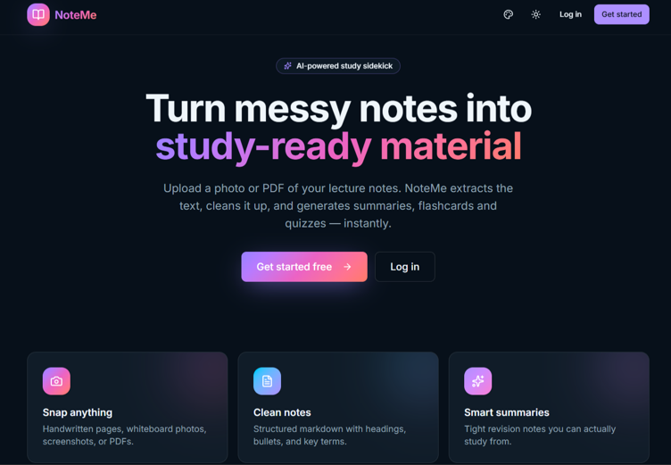
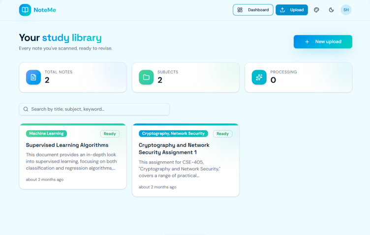
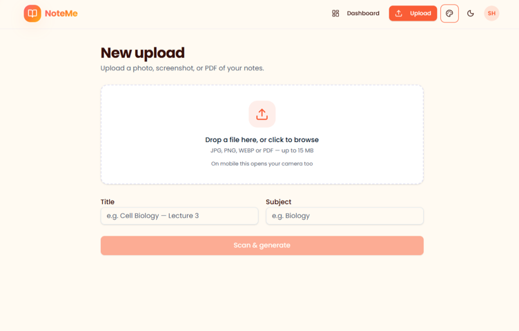
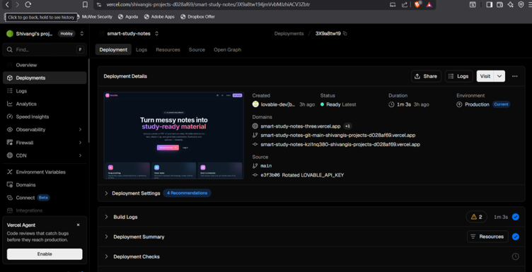

# NoteMe

An AI-powered study assistant that transforms messy handwritten or typed notes into clean, structured, and study-ready material. Built with modern web technologies, NoteMe helps students organize their notes, improve revision, and save time.

## Live Demo

**Website:** https://note--me.vercel.app/

## Screenshots

### Landing Page



### Dashboard



### Upload Notes



### Login/Sign up


###Vercel Deployed



## Features

- Convert unstructured notes into organized content
- AI-powered note formatting and restructuring
- Generate concise summaries
- Create flashcards for quick revision
- Generate quizzes from notes
- Secure user authentication with Supabase
- Responsive design for desktop and mobile

## Tech Stack

- React 19
- TypeScript
- TanStack Start
- Vite
- Tailwind CSS
- Supabase
- AI SDK
- Vercel

## Project Structure

```text
src/
├── components/
├── hooks/
├── lib/
├── routes/
├── styles/
├── utils/
└── assets/
```

## Getting Started

### Clone the repository

```bash
git clone https://github.com/ShivangiPathak1/smart-study-notes.git
```

### Navigate to the project

```bash
cd smart-study-notes
```

### Install dependencies

```bash
npm install
```

### Start the development server

```bash
npm run dev
```

## Environment Variables

Configure the required environment variables before running the application.

```env
VITE_SUPABASE_URL=your_supabase_url
VITE_SUPABASE_PROJECT_ID=your_project_id
VITE_SUPABASE_PUBLISHABLE_KEY=your_publishable_key
```

## Deployment

The application is deployed on Vercel.

**Live Demo:** https://note--me.vercel.app/

## Future Enhancements

- OCR support for handwritten notes
- Export notes as PDF
- AI-powered study planner
- Smart note categorization
- Collaboration and note sharing
- Dark/Light theme customization

## License

This project is licensed under the MIT License.

## Author

**Shivangi Pathak**

GitHub: https://github.com/ShivangiPathak1
